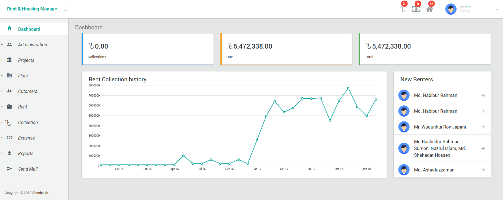
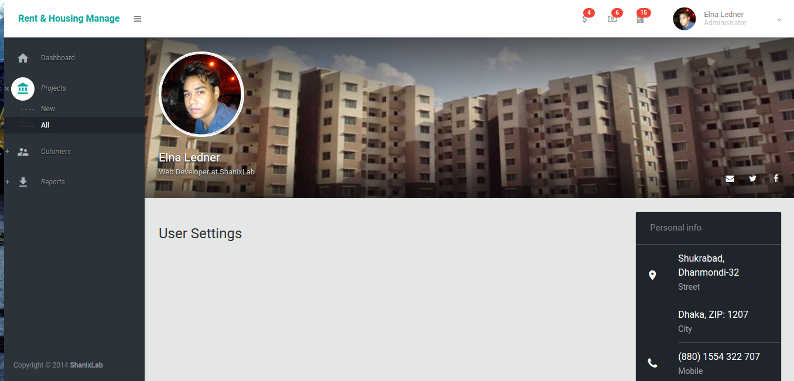
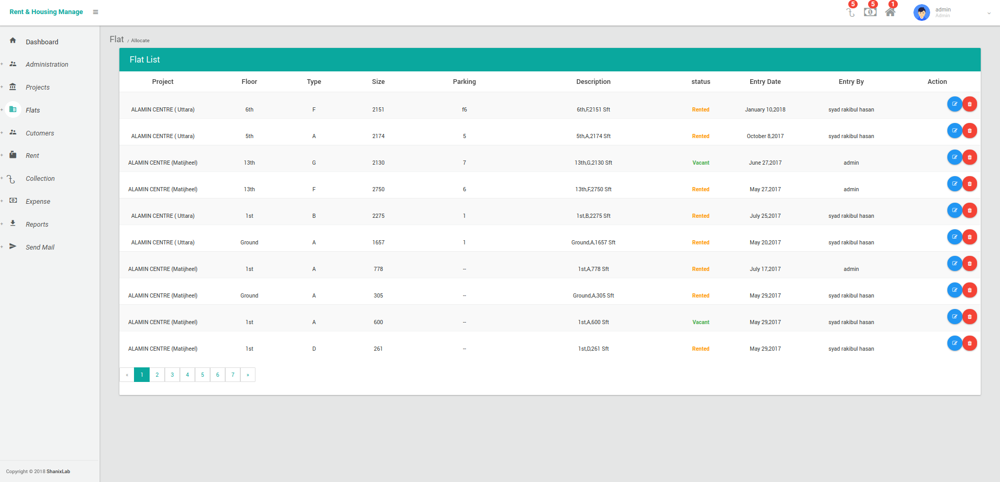
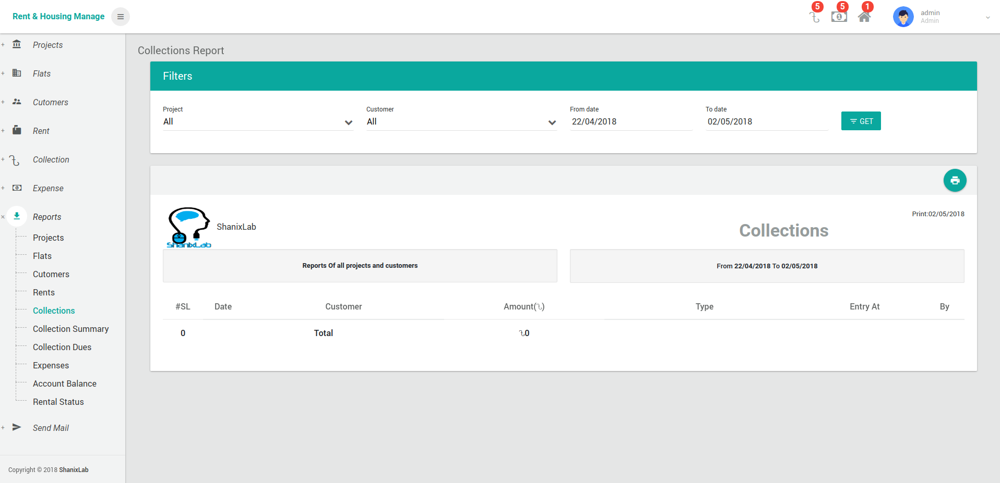

RHM[Rent & Housing Management]
==========================================

#Description
  Easy & hassle free Rent & Housing Management Web Application

## Installation and use
# HRM is build using Laravel 5.3
```
$ git clone https://github.com/hrshadhin/HRM.git
```
```
$ cd HRM
```
```
$ mv .env.example .env
```
**Change configuration in .env according your need and create Database**
```
$ composer install
```
```
$ php artisan migrate
```
```
$ php artisan db:seed
```
```
$ php artisan storage:link
```
**Give write permission to storage and bootstrap/cache directory**

```
$ php artisan serve
```
**  http://localhost:8000 **
USER: admin@hrm.com
PASS: demo123

# Demo Live Link
URL: http://hrm.hrshadhin.me
USER: admin@hrm.com
PASS: demo123


#Screenshot








#Licence
HRM is open-sourced software licensed under the AGPL-3.0 license. Frameworks and libraries has it own licensed

Enjoy :)
